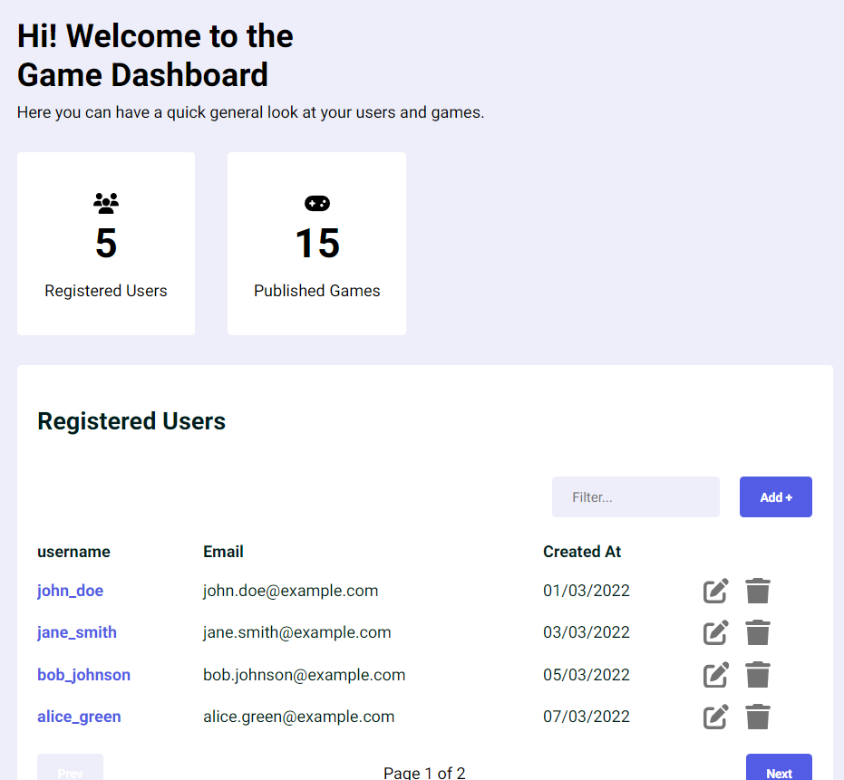

# Demo Game Dashboard

This is a Game Dashboard for the test assignment at Yolo!.



## Description

The Dashboard has been created using `React`. Only one external library was used to mock the server, called [msw](https://mswjs.io/).

For the development of the application, I followed a mobile-first approach. I used CSS Modules for the styles of the components since it doesn't require much setup.

I hope you enjoy this solution of the hometask.

Features:

- A fully responsive Dashboard
- CRUD tables for Games and users
- A mocked REST API
- Unit Tests

How to Run

```sh
Clone it

npm i
npm run start
```


